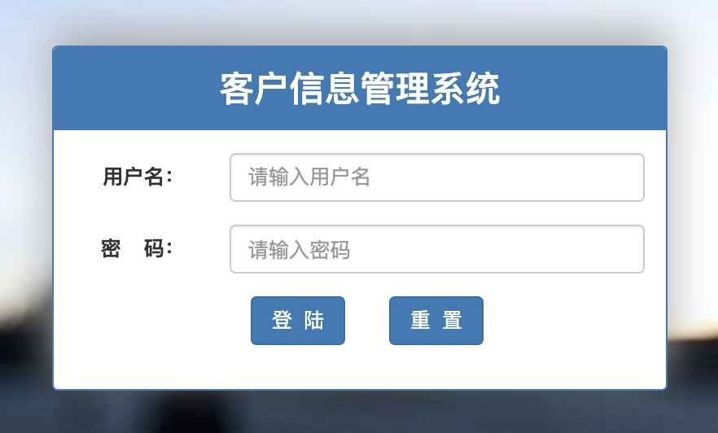
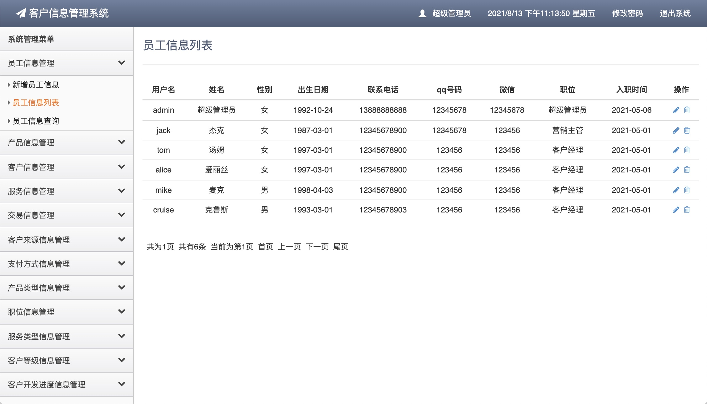
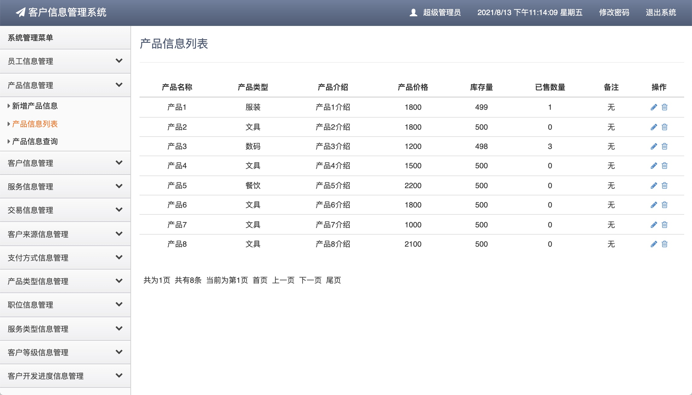
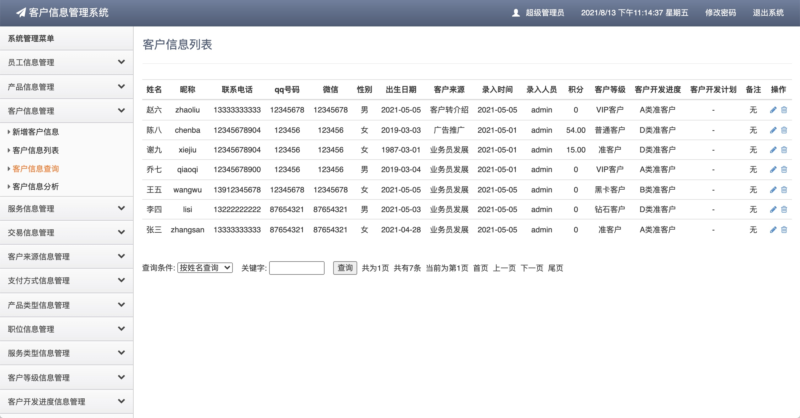
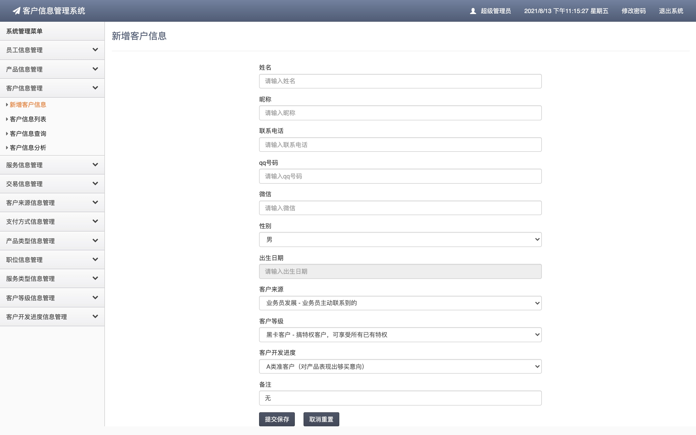
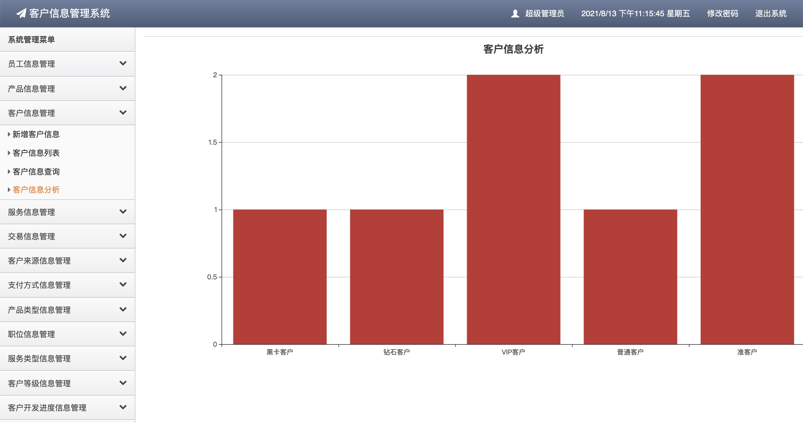
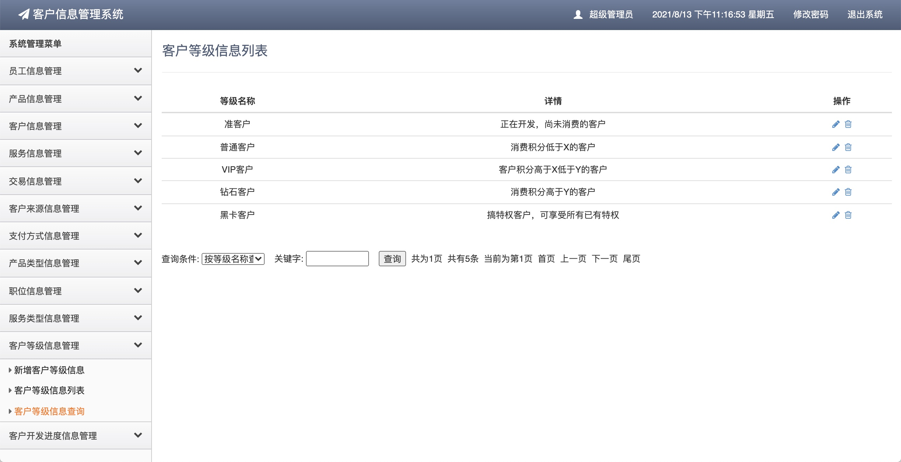

## 基于SSM的客户信息管理系统

- <b>完整代码获取地址：从戎源码网 ([https://armycodes.com/](https://armycodes.com/))</b>
- <b>技术探讨、资料分享，请加QQ群：692619798</b> 
- <b>作者微信：19941326836  QQ：952045282</b> 
- <b>承接计算机毕业设计、Java毕业设计、Python毕业设计、深度学习、机器学习</b>
- <b>选题+开题报告+任务书+程序定制+安装调试+论文+答辩ppt 一条龙服务</b>
- <b>所有选题地址 ([https://github.com/YuLin-Coder/AllProjectCatalog](https://github.com/YuLin-Coder/AllProjectCatalog)) </b>

## 项目介绍
基于SSM的客户信息管理系统，本系统主要分为三种角色，分别是：管理员、客户经理、营销主管，其功能如下：

1.管理员
主要功能包括：员工信息管理、产品信息管理、客户信息管理、服务信息管理、交易信息管理、客户来源管理、支付方式管理、产品类型管理、职位信息管理、服务类型管理、客户等级管理、客户开发进度管理。
2.客户经理
主要功能包括：产品信息管理、客户信息管理、服务信息管理、交易信息管理、基础信息查询。
3.营销主管
主要功能包括：员工信息管理、产品信息管理、客户信息管理、服务信息管理、交易信息管理、基础信息查询。
该系统功能完善、界面美观、操作简单、功能齐全、管理便捷，具有很高的实际应用价值。

## 项目技术
- 编程语言：Java
- 数据库：MySQL
- 前端技术：JSP、JavaScript、Jquery
- 后端技术：Spring、SpringMVC、MyBatis

## 运行环境
- JDK版本：JDK1.8及以上
- 开发工具：IDEA、Ecplise、Myecplise都可以
- 数据库: MySQL5.7及以上
- Maven：maven3.0及以上

## 运行截图

